# Manual de Usuario Administrador

**Sistema:** Greenex Academy  
**Perfil objetivo:** Administrador / Superadministrador  
**Versión del manual:** 1.0  
**Fecha:** 19-03-2026

---

## 1. Objetivo de este manual

Este manual explica, en lenguaje simple, cómo usar el panel de administración de Greenex Academy.

Aquí aprenderás:

- Cómo entrar al sistema.
- Cómo moverte por el panel.
- Qué hace cada módulo principal.
- Qué hace cada botón visible en las pantallas más importantes.
- Cómo administrar usuarios, roles, cursos, evaluaciones, encuestas, certificados, reportes y auditoría.
- Cómo editar cursos con módulos y documentos interactivos.

Este documento fue preparado usando pantallas reales del sistema para que el recorrido sea lo más claro posible.

---

## 2. Acceso al sistema

### 2.1. Inicio de sesión

Pantalla de acceso:

### 2.2. Campos y botones de la pantalla

- **Correo electrónico**
  Sirve para escribir el correo del usuario administrador.

- **Contraseña**
  Sirve para ingresar la clave del usuario.

- **Recordarme**
  Mantiene la sesión activa por más tiempo en el navegador actual.

- **Iniciar sesión**
  Envía los datos y abre el sistema si el correo y la contraseña son correctos.

- **¿Olvidaste tu contraseña?**
  Lleva al flujo de recuperación de clave, si esa opción está habilitada.

- **Iniciar con Google**
  Permite entrar con cuenta Google cuando el usuario tiene acceso por autenticación externa.

- **Regístrate**
  Solo aparece si el sistema permite registro manual.

### 2.3. Recomendación de uso

- Verifica que estás entrando con un usuario con rol de administración.
- Si el sistema rechaza la contraseña, intenta primero escribirla manualmente y no copiarla desde otra aplicación.

---

## 3. Vista general del panel administrador

Pantalla principal:

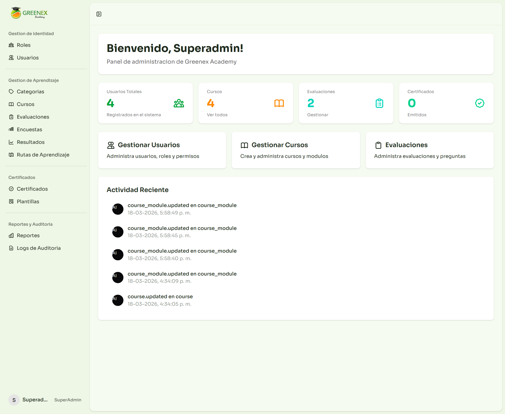

### 3.1. Qué muestra el dashboard

El dashboard es el punto de entrada del administrador. Resume el estado general del sistema.

Normalmente muestra:

- Total de usuarios.
- Total de cursos.
- Total de evaluaciones.
- Total de certificados.
- Tarjetas de acceso rápido a los módulos más usados.
- Actividad reciente del sistema.

### 3.2. Menú lateral

El menú lateral es la navegación principal del panel. Desde aquí puedes entrar a todos los módulos de administración.

Secciones visibles para administrador:

- **Gestión de Identidad**
  - Roles
  - Usuarios

- **Gestión de Aprendizaje**
  - Categorías
  - Cursos
  - Evaluaciones
  - Encuestas
  - Resultados
  - Rutas de Aprendizaje

- **Certificados**
  - Certificados
  - Plantillas

- **Reportes y Auditoría**
  - Reportes
  - Logs de Auditoría

### 3.3. Tarjetas del dashboard

Cada tarjeta muestra una métrica o acceso directo:

- **Usuarios Totales**
  Muestra cuántos usuarios existen en el sistema.

- **Cursos**
  Muestra la cantidad de cursos creados. El enlace interno permite ir al listado.

- **Evaluaciones**
  Muestra la cantidad de evaluaciones existentes. El enlace permite gestionarlas.

- **Certificados**
  Muestra cuántos certificados se han emitido.

### 3.4. Accesos rápidos

Las tarjetas grandes como **Gestionar Usuarios**, **Gestionar Cursos** y **Evaluaciones** funcionan como atajos.

Al hacer clic:

- entras directamente al módulo correspondiente;
- ahorras pasos de navegación;
- puedes comenzar una gestión sin pasar por el menú lateral.

### 3.5. Menú del usuario

En la parte inferior de la barra lateral aparece el usuario autenticado.

Opciones:

- **Perfil**
  Abre la configuración de perfil del usuario actual.

- **Cerrar Sesión**
  Finaliza la sesión activa.

---

## 4. Módulo de Usuarios

Listado de usuarios:

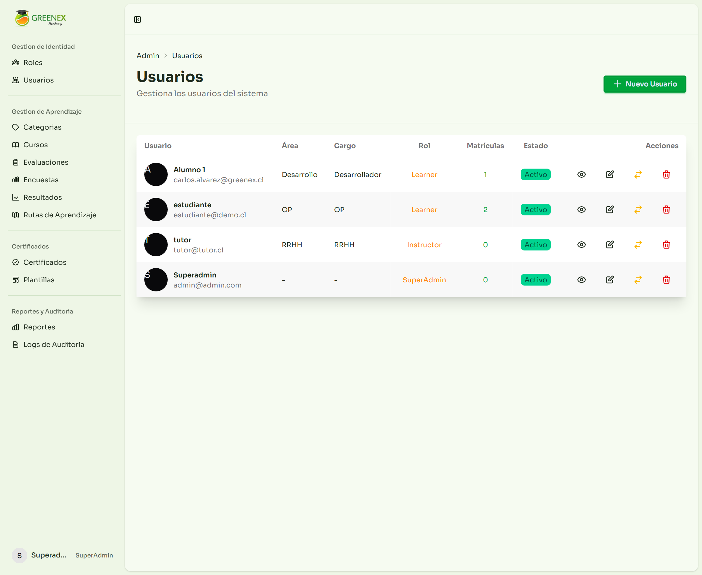

Detalle de usuario:

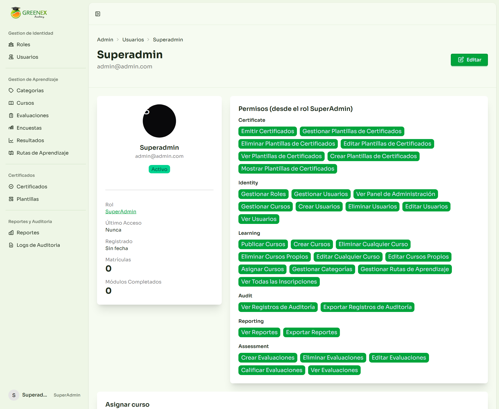

### 4.1. Para qué sirve este módulo

Este módulo permite:

- crear usuarios;
- revisar sus datos básicos;
- conocer su rol;
- ver su estado;
- revisar sus matrículas;
- ver avance en cursos;
- ver documentos interactivos enviados;
- descargar comprobantes de documentos.

### 4.2. Botones del listado de usuarios

- **Nuevo Usuario**
  Abre el formulario para registrar un usuario nuevo.

- **Ver detalles**  
  Botón con icono de ojo.
  Abre la ficha completa del usuario.

- **Editar**  
  Botón con icono de lápiz.
  Permite modificar nombre, correo, área, cargo, rol y otros datos.

- **Activar / Desactivar**  
  Botón con flechas.
  Cambia el estado del usuario.
  Si está activo, lo pasa a inactivo.
  Si está inactivo, lo vuelve a activo.

- **Eliminar**  
  Botón con icono de papelera.
  Borra el usuario después de una confirmación.
  Debe usarse con cuidado porque la acción no se puede deshacer fácilmente.

- **Paginación**
  Los botones numerados al final del listado sirven para cambiar de página cuando hay muchos usuarios.

### 4.3. Columnas del listado

- **Usuario**
  Muestra avatar inicial, nombre y correo.

- **Área**
  Muestra el área del colaborador.

- **Cargo**
  Muestra el puesto o cargo.

- **Rol**
  Muestra el rol asignado.

- **Matrículas**
  Indica cuántos cursos tiene asignados.

- **Estado**
  Muestra si el usuario está activo o inactivo.

### 4.4. Qué muestra la ficha del usuario

La ficha del usuario concentra su historial operativo dentro del sistema.

Puedes encontrar:

- datos personales;
- rol y permisos;
- cursos asignados;
- progreso de cada curso;
- fecha de matrícula;
- módulos completados;
- documentos interactivos enviados;
- acceso al comprobante de cada documento;
- historial de actividad de aprendizaje.

### 4.5. Qué revisar en la ficha del usuario

Como administrador, esta pantalla es útil cuando necesitas:

- confirmar si un usuario fue inscrito correctamente;
- revisar si terminó un curso;
- comprobar si completó documentos obligatorios;
- descargar el comprobante de un documento legal o formal;
- verificar el estado general del aprendizaje del colaborador.

---

## 5. Módulo de Roles

Listado de roles:

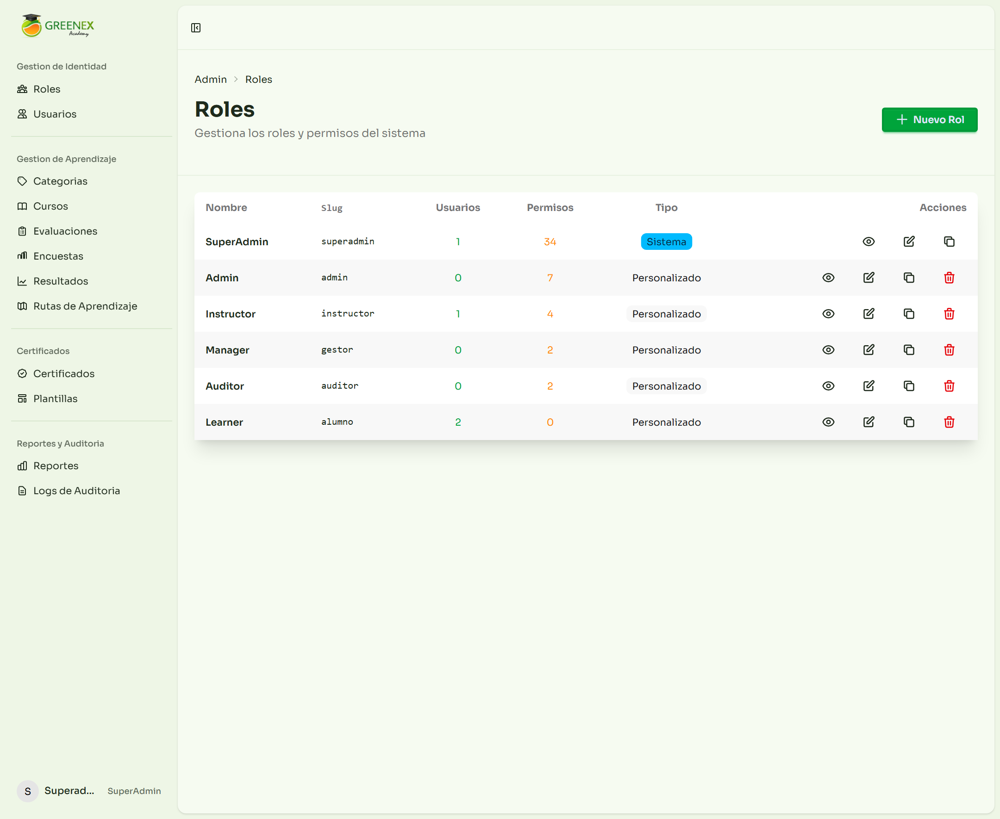

### 5.1. Para qué sirve

Este módulo controla el acceso al sistema. Aquí defines qué puede ver o hacer cada tipo de usuario.

### 5.2. Botones del módulo

- **Nuevo Rol**
  Crea un rol nuevo.

- **Ver detalles**
  Muestra la configuración del rol y sus permisos.

- **Editar**
  Permite cambiar nombre, descripción y permisos asociados.

- **Duplicar**
  Crea una copia del rol actual.
  Es útil cuando quieres partir desde una configuración existente y luego ajustarla.

- **Eliminar**
  Borra un rol personalizado.
  No se pueden eliminar roles del sistema.

- **Paginación**
  Permite cambiar entre páginas si hay varios roles.

### 5.3. Columnas del listado

- **Nombre**
  Nombre visible del rol.

- **Slug**
  Identificador interno del rol.

- **Usuarios**
  Cuántos usuarios tienen ese rol.

- **Permisos**
  Cuántos permisos contiene.

- **Tipo**
  Indica si el rol es del sistema o personalizado.

### 5.4. Recomendación de uso

- Duplica un rol parecido antes de crear uno desde cero.
- Evita modificar roles críticos del sistema sin una revisión previa.
- Si un usuario ve opciones que no debería ver, revisa aquí su rol y permisos.

---

## 6. Módulo de Categorías

Listado de categorías:

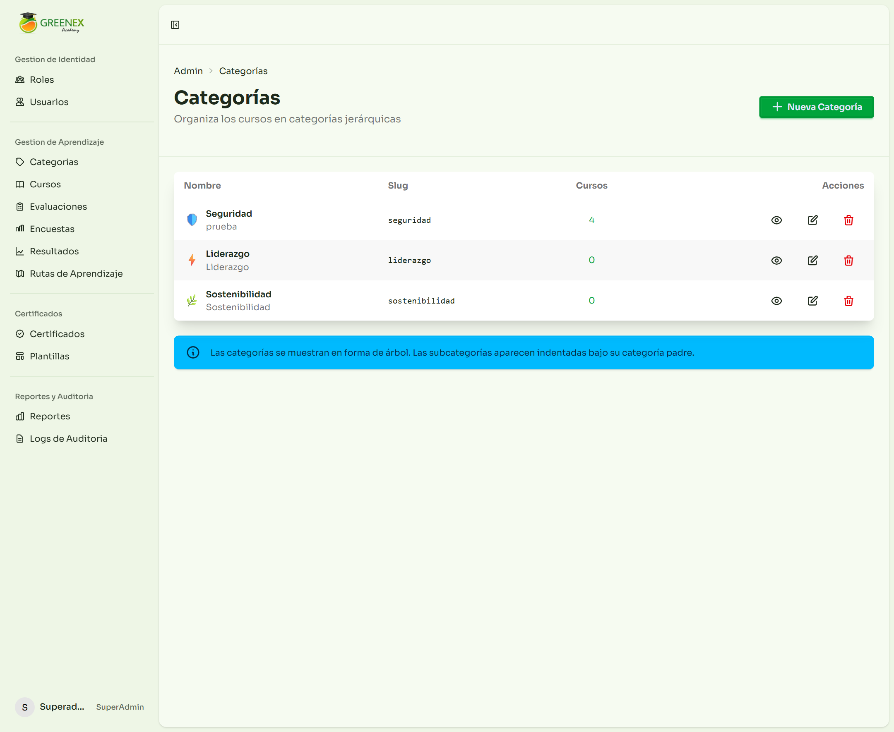

### 6.1. Para qué sirve

Las categorías ordenan los cursos. Ayudan a que el contenido sea fácil de encontrar y también permiten reportes más claros.

### 6.2. Cómo se organiza la pantalla

Las categorías se muestran en forma de árbol:

- una categoría principal puede tener subcategorías;
- las subcategorías aparecen indentadas bajo la categoría padre;
- el sistema muestra cuántos cursos hay dentro de cada una.

### 6.3. Botones del módulo

- **Nueva Categoría**
  Abre el formulario para crear una nueva categoría.

- **Ver**
  Muestra el detalle de la categoría.

- **Editar**
  Permite cambiar nombre, slug, descripción, icono, orden y categoría padre.

- **Eliminar**
  Borra la categoría.
  Si la categoría tiene cursos asociados, el sistema no permitirá eliminarla.

### 6.4. Columnas del listado

- **Nombre**
  Muestra nombre, descripción e icono.

- **Slug**
  Identificador interno.

- **Cursos**
  Cantidad de cursos vinculados a esa categoría.

- **Acciones**
  Botones de visualización, edición y eliminación.

### 6.5. Recomendación práctica

Antes de crear muchos cursos, conviene definir una estructura clara de categorías para no mezclar contenidos.

---

## 7. Módulo de Cursos

Listado de cursos:

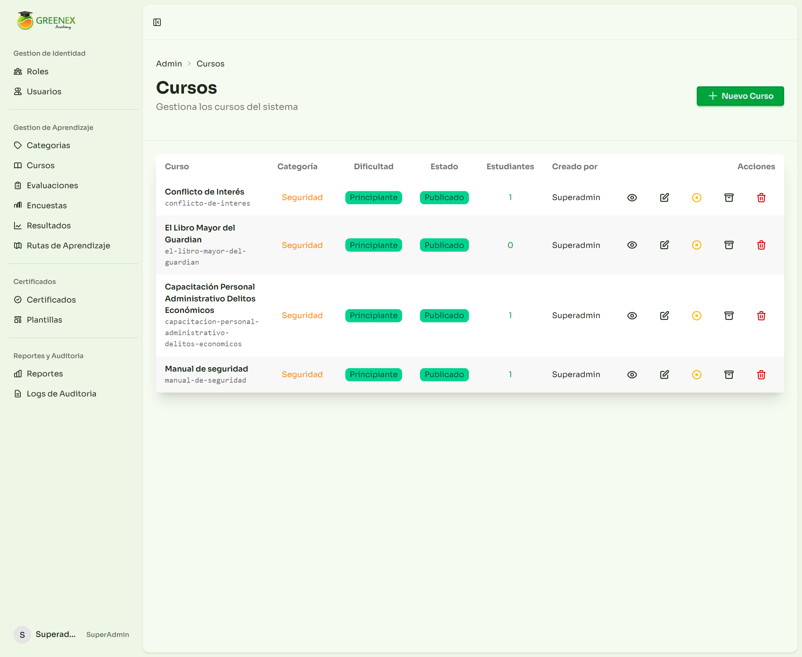

Detalle de curso:

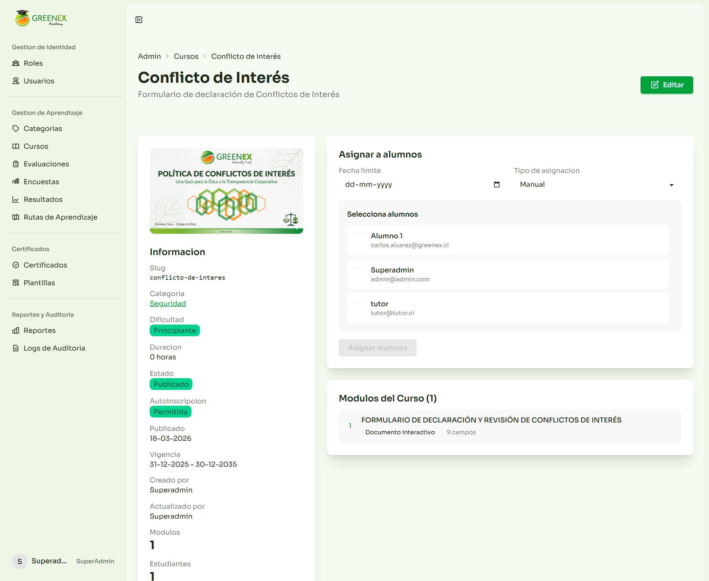

Editor de curso con documento interactivo:

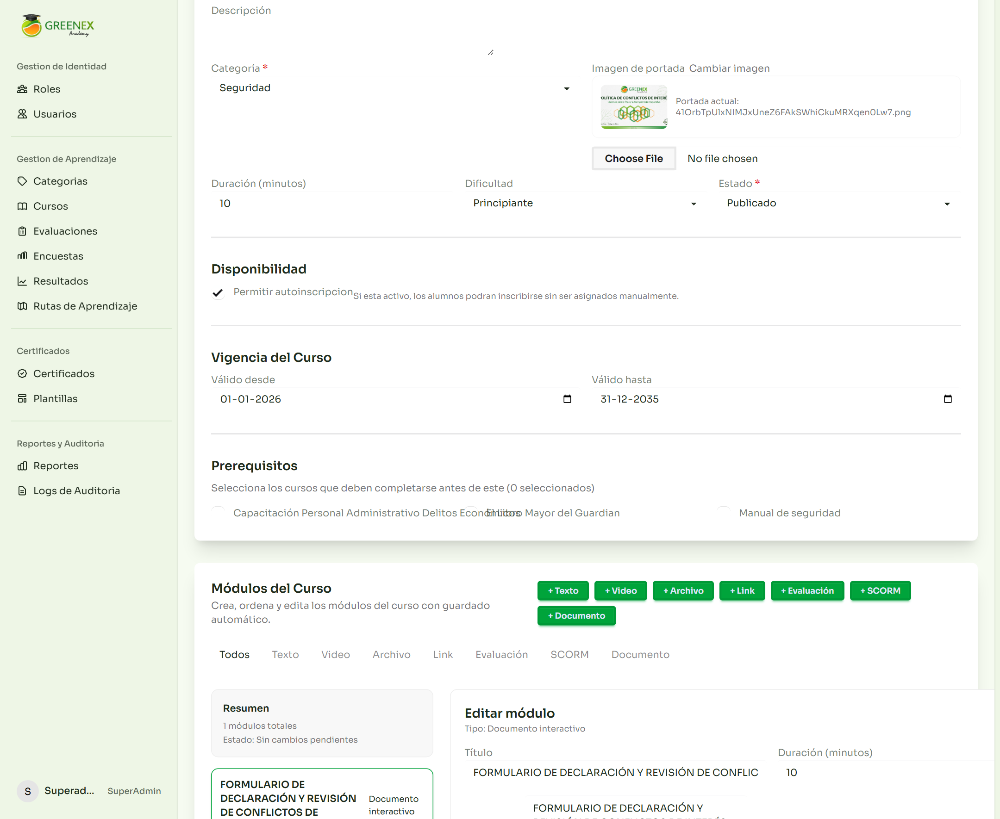

### 7.1. Para qué sirve este módulo

Es uno de los módulos más importantes del sistema.

Desde aquí puedes:

- crear cursos;
- editar su información general;
- organizar módulos;
- definir si un curso está activo o no;
- matricular usuarios;
- revisar progreso;
- crear sesiones de asistencia;
- configurar módulos especiales como evaluaciones o documentos interactivos.

### 7.2. Botones principales del listado de cursos

Dependiendo del rol y la vista, en el módulo de cursos normalmente encontrarás:

- botón para crear curso;
- acceso al detalle del curso;
- acceso a edición;
- paginación;
- botones para autoinscripción en vistas de alumno, si corresponde.

### 7.3. Qué verás en el detalle del curso

La ficha del curso sirve para revisar el curso ya creado y su operación.

Incluye:

- información general del curso;
- categoría;
- estado;
- vigencia;
- creador y actualizador;
- lista de módulos;
- lista de alumnos inscritos;
- progreso de cada matrícula;
- sesiones de asistencia;
- formulario para inscribir usuarios.

### 7.4. Botones de la ficha del curso

- **Editar**
  Abre la pantalla de edición completa del curso.

- **Botones de matrícula**
  Permiten asignar usuarios al curso.

- **Botones de sesiones de asistencia**
  Permiten crear sesiones presenciales o de control de asistencia.

- **En la tabla de matrículas**
  Se muestra el progreso, estado y fecha de matrícula del alumno.

### 7.5. Regla importante del estado de progreso

Cuando una matrícula llega a **100%**, el sistema la muestra como **Completado** y no como **En Progreso**.

Esto ayuda a que la lectura del estado sea correcta desde administración.

---

## 8. Edición de cursos y módulos

La edición del curso se divide en dos partes:

- información general del curso;
- administración de módulos.

### 8.1. Datos generales del curso

En esta parte puedes modificar:

- título;
- descripción;
- categoría;
- portada;
- duración;
- dificultad;
- estado;
- vigencia;
- autoinscripción;
- prerrequisitos.

### 8.2. Área de módulos

La edición de módulos tiene varias zonas:

- filtros por tipo;
- listado de módulos;
- formulario del módulo seleccionado;
- acciones de orden;
- guardado final del curso.

### 8.3. Filtros de módulos

Botones disponibles:

- **Todos**
- **Texto**
- **Video**
- **Archivo**
- **Link**
- **Evaluación**
- **SCORM**
- **Documento**

Estos filtros sirven para mostrar solo ciertos tipos de módulos y trabajar más rápido cuando el curso tiene muchos elementos.

### 8.4. Tarjetas de módulos

Cada módulo aparece como una tarjeta.

Dentro de cada tarjeta encontrarás:

- nombre del módulo;
- tipo;
- resumen;
- **↑**
  mueve el módulo hacia arriba;
- **↓**
  mueve el módulo hacia abajo.

### 8.5. Formulario del módulo seleccionado

Cuando haces clic en una tarjeta, el panel derecho muestra el módulo para editar.

Controles principales:

- **Eliminar**
  borra el módulo seleccionado;
- **Título**
  cambia el nombre del módulo;
- **Duración (minutos)**
  define la duración estimada;
- **Descripción**
  agrega contexto o instrucciones;
- campos específicos según el tipo de módulo;
- **Obligatorio**
  indica si el alumno debe completarlo para avanzar;
- **Vista previa**
  muestra un resumen del contenido;
- **Guardar Cambios**
  guarda los cambios generales del curso;
- **Cancelar**
  vuelve al listado de cursos sin guardar más cambios.

### 8.6. Campos específicos por tipo de módulo

- **Texto**
  aparece el campo **Contenido** para escribir texto del módulo.

- **Video** y **Archivo**
  aparece un selector para cargar un archivo.

- **Link** y **SCORM**
  aparece el campo **URL del recurso**.

- **Evaluación**
  aparece **ID de evaluación** para vincular una evaluación existente.

- **Documento interactivo**
  aparece el diseñador completo del documento.

---

## 9. Diseñador de documentos interactivos

Este es el módulo más completo del sistema para documentos formales, instructivos y formularios obligatorios.

### 9.1. Qué puedes hacer aquí

Puedes diseñar documentos que mezclan:

- texto formal;
- campos de entrada;
- selección única;
- listas;
- tablas;
- firma manuscrita;
- declaraciones obligatorias;
- vista previa tipo PDF Letter.

### 9.2. Configuración superior del documento

Campos disponibles:

- **Título formal**
  nombre principal del documento.

- **Código documental**
  código interno, útil para control documental.

- **Organización**
  nombre de la empresa o unidad responsable.

- **Texto del botón**
  texto que verá el alumno al enviar el documento.

- **Introducción**
  texto de apertura o contexto.

- **Declaración obligatoria**
  texto legal o formal que el usuario debe aceptar.

- **Nota al pie**
  texto final visible también en la presentación del documento.

### 9.3. Encabezado del diseñador

Botones visibles:

- **Vista previa Letter**
  abre un modal que simula el documento como PDF tamaño Letter.

- **Estado del guardado**
  muestra uno de estos mensajes:
  - `Sin cambios pendientes`
  - `Preparando guardado...`
  - `Cambios listos`

Este guardado fue desacoplado del tipeo para que escribir no resulte molesto.

### 9.4. Panel de campos

En el costado izquierdo aparece la biblioteca de campos.

Botones y acciones:

- **Nuevo**
  crea un campo nuevo.

- **Insertar**
  coloca el campo dentro del cuerpo del documento en la posición del cursor.

- **Configurar**
  abre el modal del campo.

- **Botón con engranaje**
  también abre la configuración del campo.

- **Botón con papelera**
  elimina el campo.

- **Drag & Drop**
  cada campo se puede arrastrar desde la biblioteca hacia la hoja del documento.

### 9.5. Tipos de campo disponibles

Actualmente el diseñador permite crear:

- Texto corto
- Texto largo
- Firma manuscrita
- Checkbox
- Seleccionable
- Opción única
- Fecha
- Correo
- Número

### 9.6. Barra de formato del documento

La hoja del documento tiene una barra con estos botones:

- **P**
  convierte el bloque actual en párrafo.

- **H1**
  aplica encabezado principal.

- **H2**
  aplica encabezado secundario.

- **H3**
  aplica encabezado terciario.

- **Negrita**
  resalta el texto.

- **Cursiva**
  aplica estilo inclinado.

- **Subrayado**
  subraya el texto.

- **Lista**
  inserta una lista con viñetas.

- **Numerada**
  inserta una lista numerada.

- **Tabla**
  inserta una tabla base con columnas para pregunta, respuesta y detalle.

### 9.7. Herramientas de tabla

Cuando seleccionas una celda, se activa el bloque **Tabla activa**.

Botones disponibles:

- **Fila +**
  agrega una fila debajo de la fila seleccionada.

- **Fila -**
  elimina la fila seleccionada.

- **Columna +**
  agrega una columna nueva.

- **Columna -**
  elimina la columna seleccionada.

- **Ens. +**
  aumenta el ancho de la columna actual.

- **Ens. -**
  reduce el ancho de la columna actual.

El editor también muestra un indicador como:

- `Fila X · Columna Y · N columnas`

Esto sirve para saber exactamente dónde estás trabajando.

### 9.8. Área de la hoja

La hoja central funciona como un documento formal tipo Word.

Puedes:

- escribir texto libre;
- pegar contenido;
- insertar campos;
- arrastrar campos;
- crear tablas;
- reorganizar visualmente el documento.

### 9.9. Modal “Configurar campo”

Este modal aparece cuando presionas **Configurar** o el botón de engranaje.

Contiene:

- **Etiqueta**
  nombre visible del campo.

- **Clave**
  identificador interno estable.
  Es importante porque evita que el sistema mezcle campos cuando cambias el nombre visible.

- **Tipo**
  define el comportamiento del campo.

- **Placeholder**
  texto de ejemplo.

- **Texto de ayuda**
  explicación breve para el usuario final.

- **Campo obligatorio**
  obliga al usuario a completarlo antes de enviar.

- **Cancelar**
  cierra la ventana sin aplicar cambios.

- **Guardar campo**
  guarda la configuración del campo.

### 9.10. Configuración de opciones en selección única o seleccionable

Si el campo es de tipo **Seleccionable** u **Opción única**, aparece una zona especial para opciones de respuesta.

Botones y acciones:

- **Agregar opción**
  crea una alternativa nueva.

- **Texto visible**
  define lo que verá el usuario.

- **Valor**
  define el valor interno de la opción.

- **Configurar detalle / Editar detalle**
  abre o muestra la configuración del detalle dependiente.

- **Eliminar opción**
  borra una alternativa.

- **Solicitar detalle al elegir esta opción**
  activa un campo adicional solo para esa respuesta.

### 9.11. Detalle dependiente por opción

Esta función es muy útil cuando una respuesta requiere explicación adicional.

Ejemplo:

- **Sí** → mostrar “Indique el detalle”.
- **No** → mostrar “Explique el motivo”.

Opciones de configuración del detalle:

- **Etiqueta del detalle**
- **Placeholder del detalle**
- **Ayuda del detalle**
- **Exigir este detalle cuando la opción esté seleccionada**

### 9.12. Campo de firma manuscrita

El diseñador permite crear un campo de firma manuscrita.

Cuando este campo se usa en un documento:

- el alumno firma dibujando en un recuadro;
- puede limpiar y volver a firmar;
- si el campo es obligatorio, el documento no se puede enviar sin firma;
- la firma queda visible en el comprobante PDF.

### 9.13. Vista previa Letter

La **Vista previa Letter** abre una simulación de impresión.

Sirve para revisar:

- presentación formal;
- encabezado;
- código documental;
- introducción;
- distribución del cuerpo;
- tablas;
- pie del documento.

Es la mejor forma de revisar si el documento se ve serio y correcto antes de publicarlo.

---

## 10. Módulo de Evaluaciones

Listado de evaluaciones:

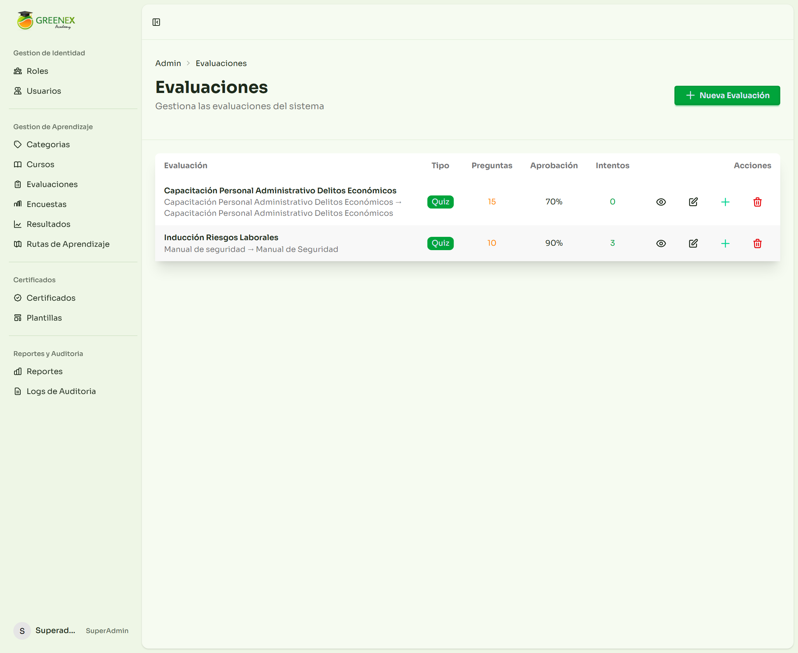

### 10.1. Para qué sirve

Este módulo administra pruebas, quizzes, exámenes y tareas vinculadas a cursos y módulos.

### 10.2. Botones del módulo

- **Nueva Evaluación**
  crea una evaluación nueva.

- **Ver detalles**
  abre la ficha de la evaluación.

- **Editar**
  modifica datos y configuración.

- **Agregar pregunta**
  abre el formulario para crear una pregunta dentro de la evaluación.

- **Eliminar**
  borra la evaluación.
  Si ya existen intentos, el sistema la protege y no permite eliminarla.

- **Paginación**
  cambia de página cuando hay muchos registros.

### 10.3. Columnas del listado

- **Evaluación**
  muestra el nombre y el módulo/curso asociado.

- **Tipo**
  puede mostrarse como Quiz, Examen, Tarea o Encuesta.

- **Preguntas**
  cantidad de preguntas creadas.

- **Aprobación**
  porcentaje mínimo para aprobar.

- **Intentos**
  cantidad de intentos registrados por los usuarios.

### 10.4. Cuándo usar este módulo

Úsalo cuando necesites medir conocimientos, validar comprensión de un curso o exigir una aprobación formal.

---

## 11. Módulo de Encuestas

Listado de encuestas:

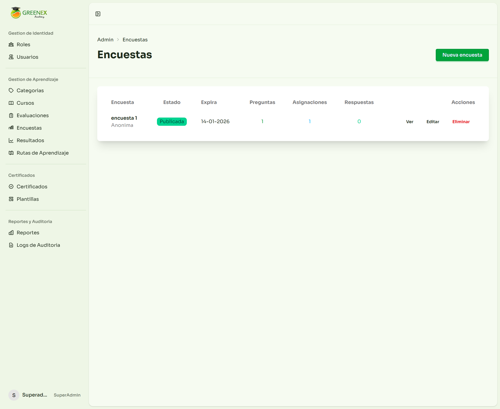

### 11.1. Para qué sirve

Permite crear encuestas de satisfacción, percepción, levantamiento de información o retroalimentación.

### 11.2. Botones del módulo

- **Nueva encuesta**
  crea una encuesta nueva.

- **Ver**
  abre el detalle de la encuesta.

- **Editar**
  permite cambiar preguntas, estado y configuración.

- **Eliminar**
  borra la encuesta.

### 11.3. Qué muestra el listado

- **Encuesta**
  nombre y si es anónima o con identidad.

- **Estado**
  puede ser Publicada, Borrador o Cerrada.

- **Expira**
  muestra la fecha de cierre si existe.

- **Preguntas**
  cantidad de preguntas.

- **Asignaciones**
  cantidad de usuarios o destinatarios.

- **Respuestas**
  total de respuestas recibidas.

### 11.4. Recomendación de uso

Usa encuestas cuando no necesitas un documento formal con firma, sino una recopilación estructurada de respuestas.

---

## 12. Módulo de Rutas de Aprendizaje

Listado de rutas:

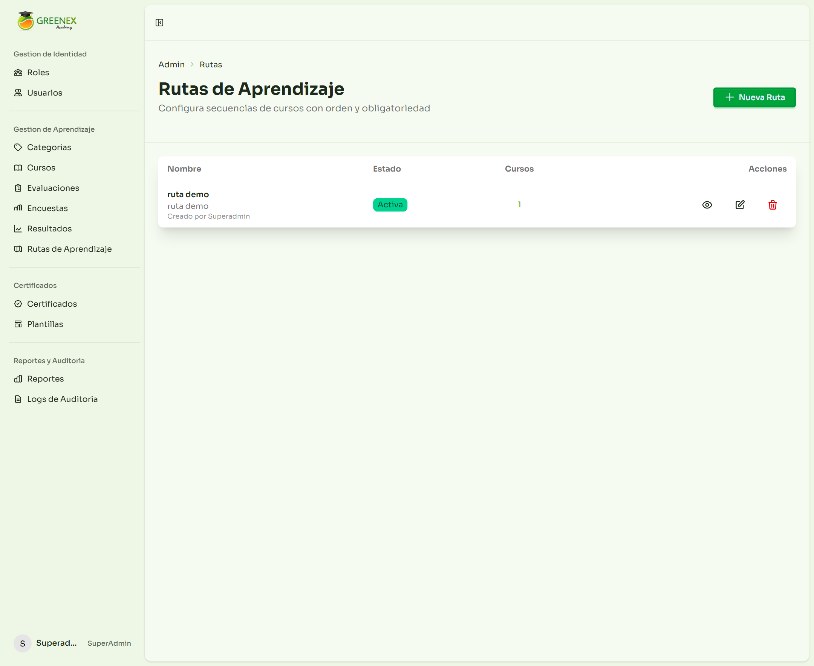

### 12.1. Para qué sirve

Las rutas permiten agrupar cursos en una secuencia lógica.

Sirven para:

- planes de onboarding;
- trayectorias por cargo;
- planes de formación por área;
- procesos de cumplimiento escalonado.

### 12.2. Botones del módulo

- **Nueva Ruta**
  crea una ruta nueva.

- **Ver**
  abre la ficha de la ruta.

- **Editar**
  modifica nombre, descripción, estado y cursos asociados.

- **Eliminar**
  borra la ruta.

- **Paginación**
  cambia entre páginas.

### 12.3. Qué muestra cada fila

- nombre;
- descripción;
- creador;
- estado;
- cantidad de cursos.

---

## 13. Módulo de Certificados

Listado de certificados:

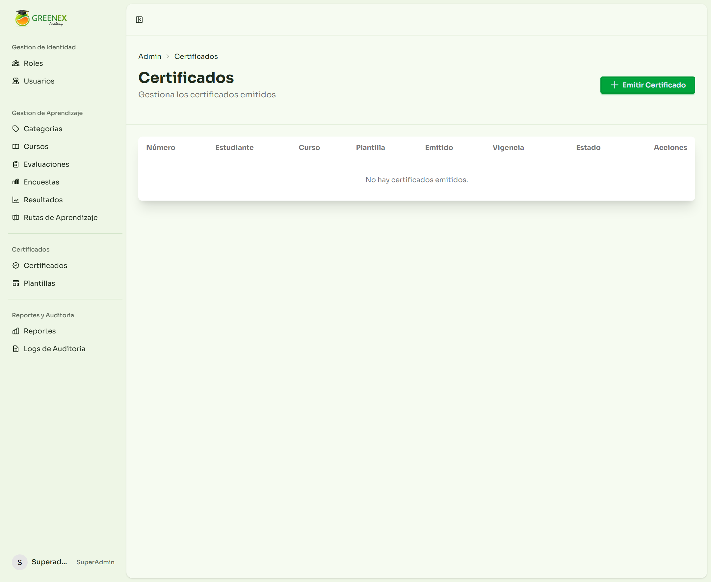

### 13.1. Para qué sirve

Administra certificados emitidos a los usuarios cuando cumplen las reglas de aprobación o finalización.

### 13.2. Botones del módulo

- **Emitir Certificado**
  genera un certificado nuevo manualmente.

- **Ver detalles**
  abre la ficha completa del certificado.

- **Descargar PDF**
  descarga el certificado en formato PDF.

- **Revocar**
  invalida un certificado vigente.
  El sistema solicita una razón de revocación.

- **Paginación**
  cambia entre páginas.

### 13.3. Columnas del listado

- **Número**
  identificador único del certificado.

- **Estudiante**
  persona que recibió el certificado.

- **Curso**
  curso asociado.

- **Plantilla**
  diseño utilizado.

- **Emitido**
  fecha de emisión.

- **Vigencia**
  fecha de vencimiento o “Sin vencimiento”.

- **Estado**
  puede ser Vigente o Revocado.

### 13.4. Nota importante

La revocación debe usarse solo cuando hay una razón formal, porque afecta la validez del documento emitido.

---

## 14. Módulo de Plantillas de Certificados

Listado de plantillas:

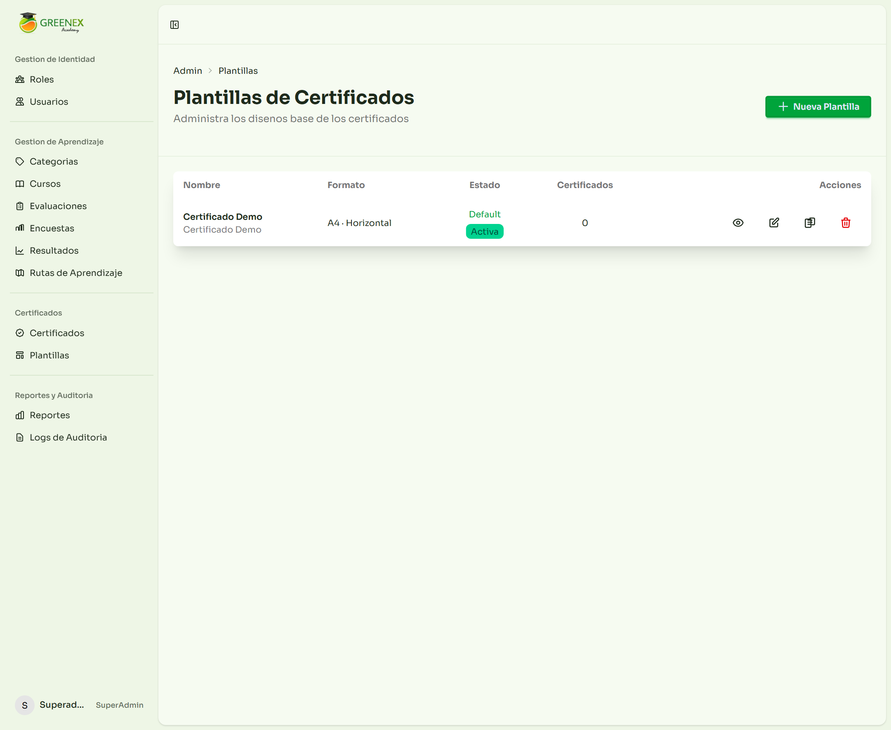

### 14.1. Para qué sirve

Aquí se administran los diseños base de los certificados.

### 14.2. Botones del módulo

- **Nueva Plantilla**
  crea una plantilla desde cero.

- **Ver**
  abre la plantilla para revisión.

- **Editar**
  modifica el diseño de la plantilla.

- **Duplicar**
  crea una copia.
  Es útil para crear variantes sin tocar la original.

- **Eliminar**
  borra la plantilla.
  Si ya se utilizó en certificados emitidos, el sistema la protege.

- **Paginación**
  cambia entre páginas.

### 14.3. Qué muestra el listado

- nombre;
- descripción;
- tamaño del documento;
- orientación;
- si es plantilla por defecto;
- si está activa;
- cuántos certificados la usan.

### 14.4. Uso recomendado

Conviene mantener una plantilla principal por defecto y duplicarla cuando se necesiten versiones por área, tipo de formación o marca.

---

## 15. Módulo de Reportes

Pantalla de reportes:

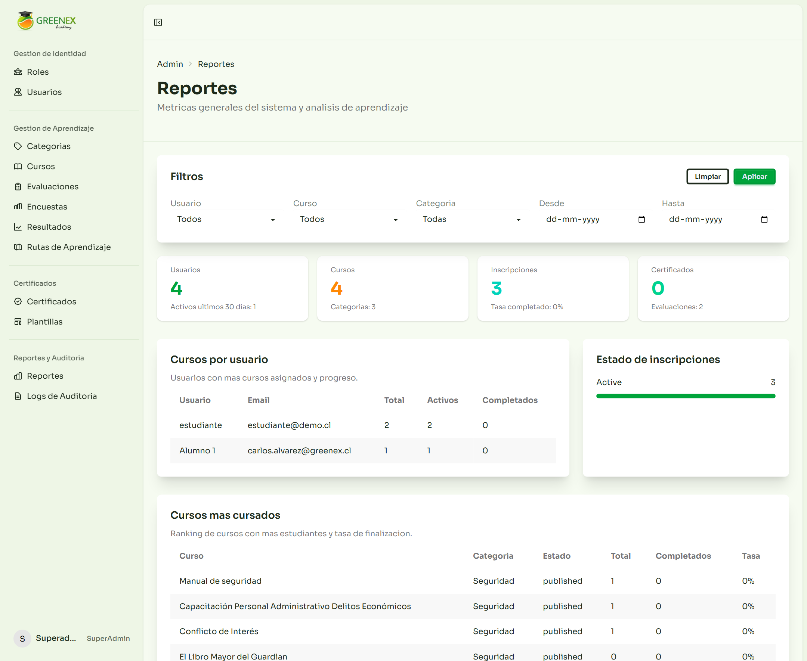

### 15.1. Para qué sirve

Permite revisar métricas globales del sistema y analizar el comportamiento del aprendizaje.

### 15.2. Filtros disponibles

- **Usuario**
  filtra por persona.

- **Curso**
  filtra por curso.

- **Categoría**
  filtra por categoría.

- **Desde**
  fecha inicial del rango.

- **Hasta**
  fecha final del rango.

### 15.3. Botones del módulo

- **Aplicar**
  ejecuta los filtros seleccionados.

- **Limpiar**
  quita todos los filtros.

### 15.4. Qué muestran los indicadores

- **Usuarios**
  total de usuarios y cuántos estuvieron activos recientemente.

- **Cursos**
  total de cursos y total de categorías.

- **Inscripciones**
  total de matrículas y tasa de completitud.

- **Certificados**
  total de certificados y total de evaluaciones.

### 15.5. Bloques analíticos

- **Cursos por usuario**
  muestra quién tiene más cursos, cuántos tiene activos y cuántos completó.

- **Estado de inscripciones**
  muestra el reparto entre estados.

- **Cursos más cursados**
  ranking con total de inscritos y tasa de finalización.

### 15.6. Cuándo usar reportes

Este módulo es útil para:

- seguimiento de cumplimiento;
- análisis de uso de la plataforma;
- revisión por área;
- reuniones de gestión;
- decisiones sobre capacitación futura.

---

## 16. Módulo de Logs de Auditoría

Pantalla de auditoría:

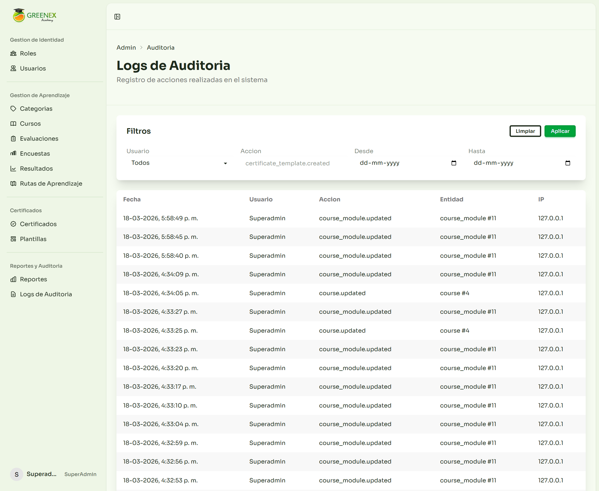

### 16.1. Para qué sirve

Registra acciones realizadas en el sistema.

Es clave para trazabilidad y control.

### 16.2. Filtros disponibles

- **Usuario**
  filtra por persona que ejecutó la acción.

- **Acción**
  filtra por texto de la acción.
  Ejemplo: `certificate_template.created`.

- **Desde**
  fecha inicial.

- **Hasta**
  fecha final.

### 16.3. Botones del módulo

- **Aplicar**
  ejecuta los filtros.

- **Limpiar**
  reinicia la búsqueda.

- **Paginación**
  cambia de página.

### 16.4. Qué muestra cada registro

- **Fecha**
  momento exacto del evento.

- **Usuario**
  quién ejecutó la acción.
  Si aparece “Sistema”, significa que la acción fue automática.

- **Acción**
  nombre técnico del evento.

- **Entidad**
  objeto afectado, por ejemplo usuario, plantilla o curso.

- **IP**
  dirección registrada del origen.

### 16.5. Cuándo revisar auditoría

Revisa este módulo cuando necesites:

- saber quién cambió algo;
- investigar un error;
- validar una acción administrativa;
- comprobar trazabilidad de documentos o configuraciones.

---

## 17. Recomendaciones operativas para administradores

- Revisa primero el dashboard y luego entra al módulo específico.
- Antes de eliminar, confirma si el registro tiene historial asociado.
- En cursos y documentos interactivos, revisa siempre la vista previa antes de publicar.
- Usa nombres claros y consistentes para cursos, roles, categorías y plantillas.
- Cuando un proceso tenga valor legal o formal, descarga y conserva los comprobantes correspondientes.
- Antes de revocar certificados o cambiar roles, deja trazabilidad interna del motivo.

---

## 18. Buenas prácticas al trabajar con documentos interactivos

- Usa un **título formal** claro.
- Completa siempre el **código documental**.
- Agrega una **introducción breve** para contextualizar al usuario.
- Usa la **declaración obligatoria** para registrar lectura y aceptación.
- Marca como **obligatorios** los campos realmente necesarios.
- En preguntas de selección única, usa **detalle dependiente** solo cuando la respuesta lo requiera.
- Si el documento necesita confirmación personal, incorpora **firma manuscrita** obligatoria.
- Usa la **Vista previa Letter** antes de cerrar el diseño.

---

## 19. Problemas frecuentes y solución rápida

### 19.1. Un botón no hace nada visible

- Revisa si faltan permisos.
- Revisa si el registro tiene restricciones.
- Revisa si aparece una confirmación del navegador.

### 19.2. No se puede eliminar un registro

En muchos módulos esto es intencional.

Ejemplos:

- una evaluación con intentos no se puede eliminar;
- una categoría con cursos asociados no se puede eliminar;
- una plantilla de certificado usada no se puede eliminar;
- un rol del sistema no se puede eliminar.

### 19.3. Un documento interactivo no se ve bien

- abre la **Vista previa Letter**;
- revisa tablas;
- revisa saltos de texto;
- confirma que los campos estén insertados correctamente;
- valida que no existan campos duplicados con etiquetas confusas.

### 19.4. Un usuario no avanza en el curso

- revisa si tiene módulos obligatorios pendientes;
- revisa si la evaluación exige aprobación;
- revisa si falta un documento interactivo obligatorio;
- revisa el detalle del usuario y del curso.

---

## 20. Cierre

El panel de administración de Greenex Academy concentra toda la operación principal del sistema:

- personas;
- permisos;
- estructura formativa;
- evaluación;
- certificación;
- control;
- trazabilidad.

La recomendación general es trabajar siempre de esta forma:

1. revisar el contexto;
2. entrar al módulo correcto;
3. confirmar el impacto de cada acción;
4. guardar solo cuando la información esté completa;
5. usar reportes y auditoría como respaldo de control.

---

## 21. Anexo rápido: resumen de botones por módulo

### Usuarios

- Nuevo Usuario
- Ver detalles
- Editar
- Activar / Desactivar
- Eliminar

### Roles

- Nuevo Rol
- Ver detalles
- Editar
- Duplicar
- Eliminar

### Categorías

- Nueva Categoría
- Ver
- Editar
- Eliminar

### Cursos

- Editar
- Guardar Cambios
- Cancelar
- Eliminar módulo
- Subir / Bajar módulo

### Diseñador de documentos interactivos

- Vista previa Letter
- Nuevo campo
- Insertar
- Configurar
- Eliminar campo
- P / H1 / H2 / H3
- Negrita / Cursiva / Subrayado
- Lista / Numerada
- Tabla
- Fila + / Fila -
- Columna + / Columna -
- Ens. + / Ens. -
- Guardar campo
- Cancelar

### Evaluaciones

- Nueva Evaluación
- Ver detalles
- Editar
- Agregar pregunta
- Eliminar

### Encuestas

- Nueva encuesta
- Ver
- Editar
- Eliminar

### Rutas de Aprendizaje

- Nueva Ruta
- Ver
- Editar
- Eliminar

### Certificados

- Emitir Certificado
- Ver detalles
- Descargar PDF
- Revocar

### Plantillas de Certificados

- Nueva Plantilla
- Ver
- Editar
- Duplicar
- Eliminar

### Reportes

- Aplicar
- Limpiar

### Auditoría

- Aplicar
- Limpiar
