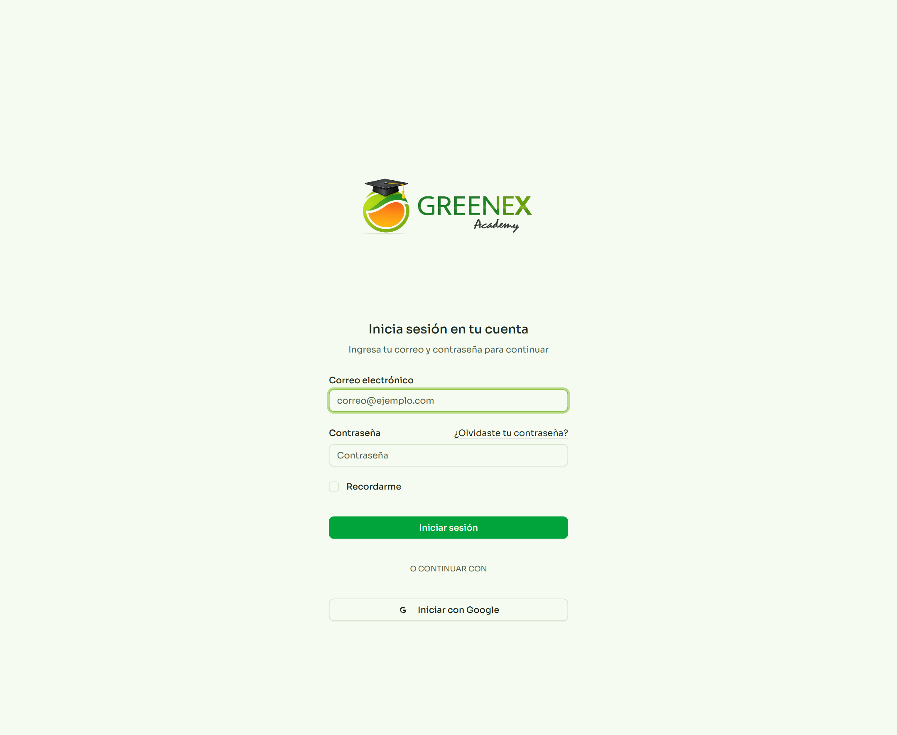
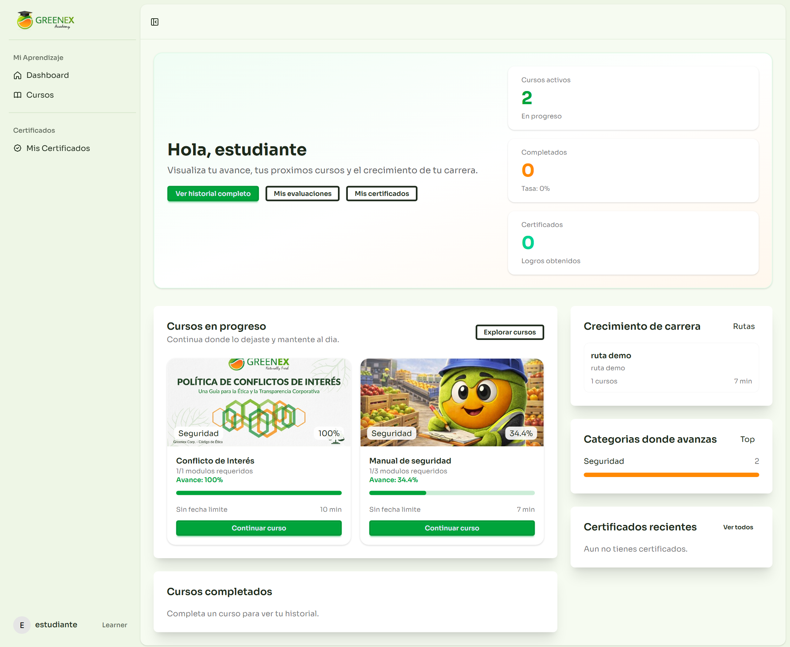
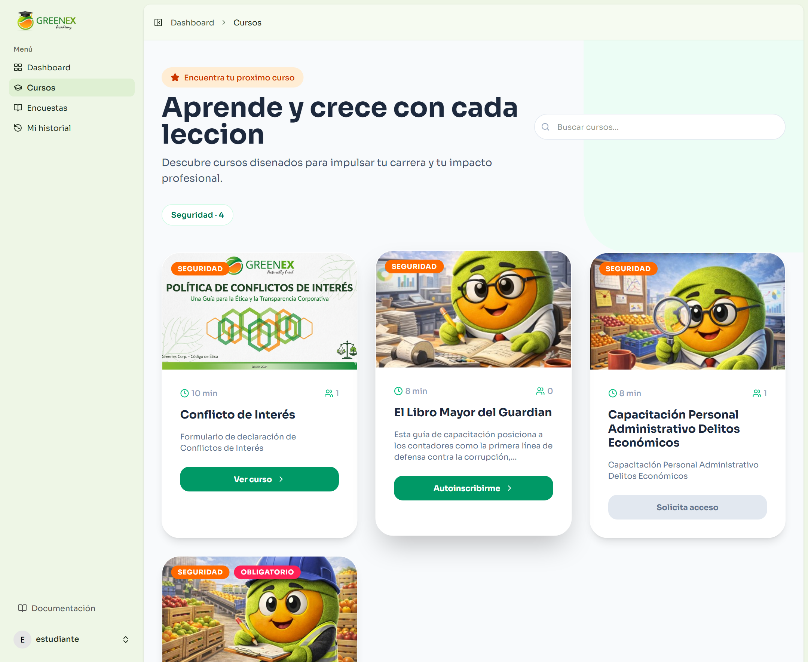
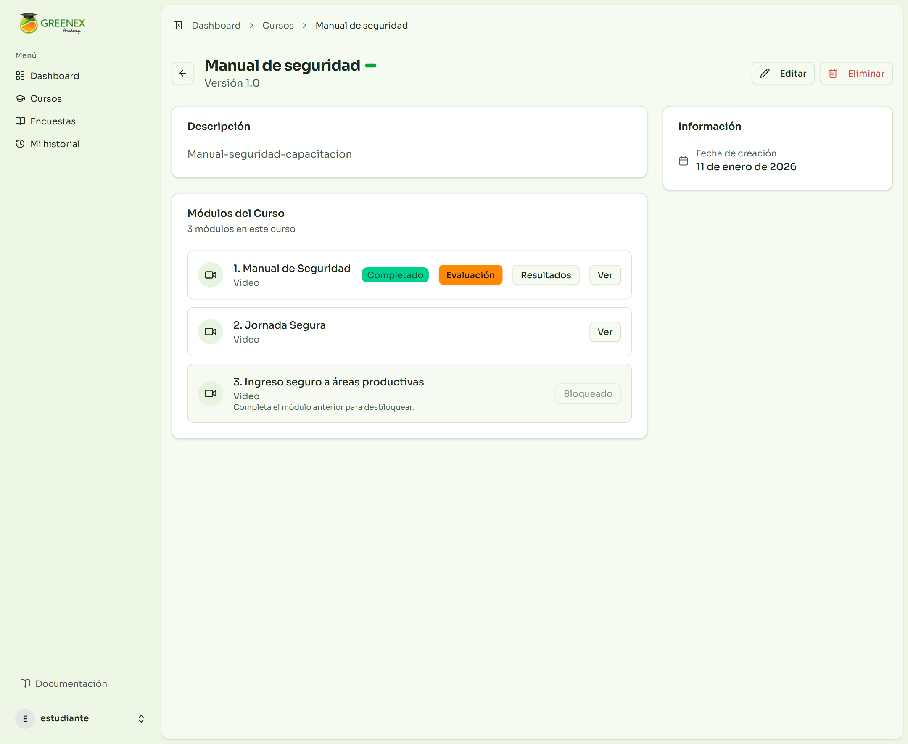
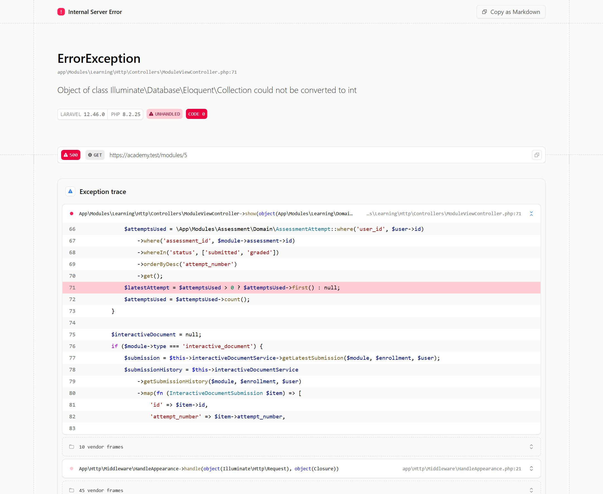
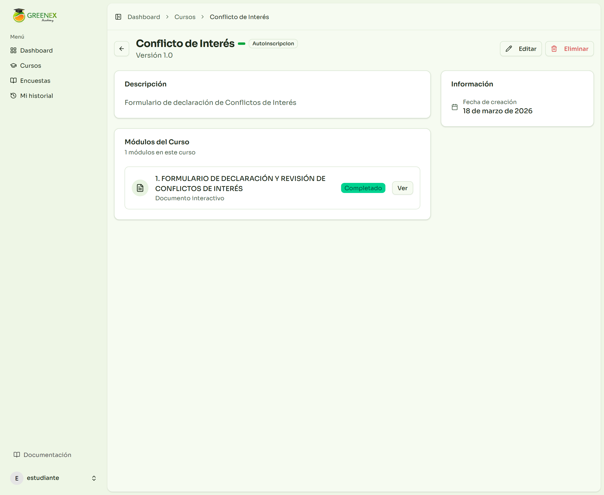
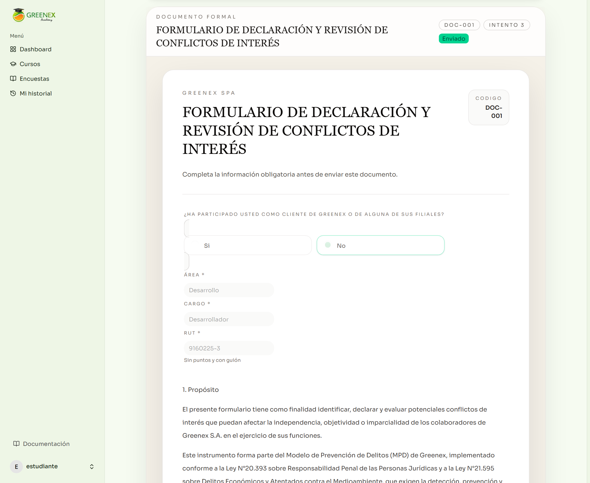
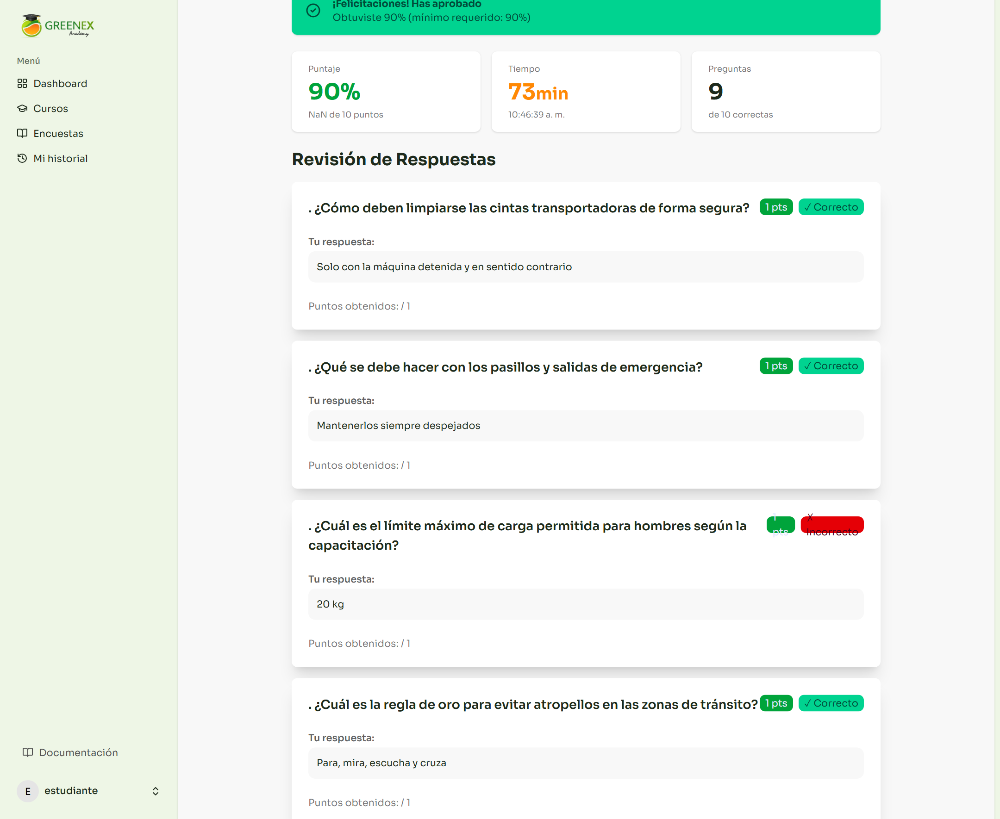
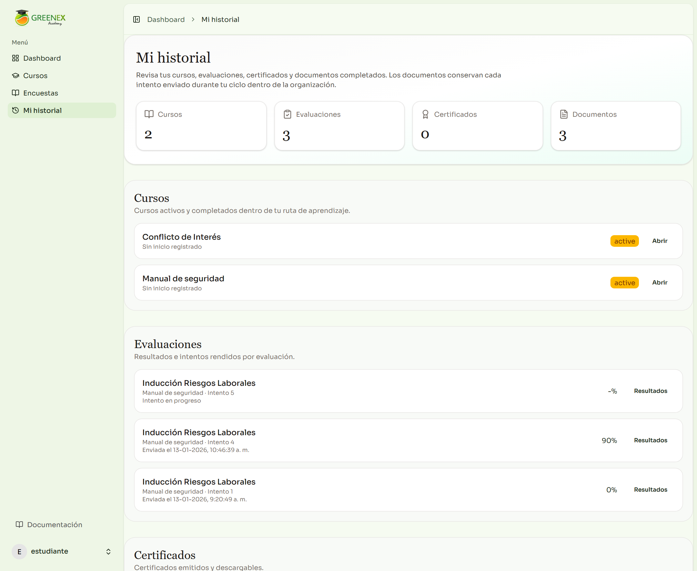
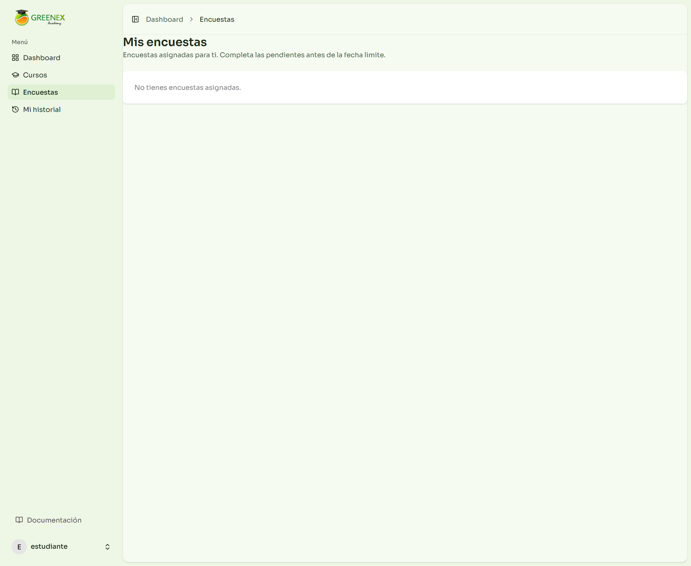

# Manual de Usuario

**Sistema:** Greenex Academy  
**Perfil objetivo:** Colaborador / Alumno  
**Versión del manual:** 1.0  
**Fecha:** 19-03-2026

---

## 1. Objetivo del manual

Este manual explica cómo usar Greenex Academy desde la perspectiva del usuario final.

Aquí aprenderás:

- cómo iniciar sesión;
- cómo moverte por el sistema;
- cómo revisar tus cursos;
- cómo abrir módulos;
- cómo responder evaluaciones;
- cómo completar documentos interactivos;
- cómo revisar tu historial;
- cómo identificar pantallas vacías o pendientes.

El lenguaje de este manual es simple y directo para que cualquier colaborador pueda usar la plataforma sin ayuda técnica.

---

## 2. Ingreso al sistema

Pantalla de acceso:

### 2.1. Elementos de la pantalla

- **Correo electrónico**
  Aquí debes escribir tu correo de acceso.

- **Contraseña**
  Aquí debes escribir tu clave.

- **Recordarme**
  Mantiene tu sesión abierta en el navegador actual por más tiempo.

- **Iniciar sesión**
  Envía tus datos y abre la plataforma.

- **¿Olvidaste tu contraseña?**
  Te lleva al proceso de recuperación, si está habilitado.

- **Iniciar con Google**
  Permite entrar con cuenta Google cuando tu organización usa acceso federado.

### 2.2. Recomendaciones al ingresar

- Verifica que el correo esté bien escrito.
- Si la plataforma no te deja entrar, revisa mayúsculas y minúsculas de la clave.
- Si usas un equipo compartido, no actives “Recordarme”.

---

## 3. Dashboard del usuario

Pantalla principal del alumno:

### 3.1. Para qué sirve esta pantalla

El dashboard es tu punto de inicio. Desde aquí puedes ver rápidamente:

- cursos activos;
- cursos completados;
- certificados recientes;
- rutas de aprendizaje;
- categorías donde más avanzas;
- accesos rápidos a otras secciones.

### 3.2. Menú lateral del usuario

El menú lateral normalmente incluye:

- **Dashboard**
  Vuelve a la pantalla principal.

- **Cursos**
  Abre el catálogo o listado de cursos disponibles para ti.

- **Encuestas**
  Muestra las encuestas asignadas.

- **Mi historial**
  Muestra tu historial completo de cursos, evaluaciones, certificados y documentos.

- **Documentación**
  Espacio de apoyo o referencia si tu organización lo usa.

### 3.3. Botones y accesos rápidos del dashboard

- **Ver historial completo**
  Abre la pantalla de historial personal.

- **Mis evaluaciones**
  Lleva al área donde puedes revisar intentos y resultados, si tu instalación la tiene disponible.

- **Mis certificados**
  Lleva al listado de certificados emitidos para tu usuario, cuando existan.

- **Explorar cursos**
  Abre el listado general de cursos.

- **Continuar curso**
  Abre directamente un curso en progreso.

- **Ver todos**
  Muestra el listado completo de certificados recientes o cursos, según la sección donde aparezca.

### 3.4. Tarjetas del dashboard

En el dashboard verás indicadores como:

- **Cursos activos**
  Muestra cuántos cursos estás realizando.

- **Completados**
  Muestra cuántos cursos ya terminaste.

- **Certificados**
  Muestra tus certificados emitidos.

### 3.5. Bloques informativos

- **Cursos en progreso**
  Muestra tarjetas con imagen, categoría, porcentaje de avance y botón de acceso.

- **Cursos completados**
  Resume los cursos finalizados.

- **Crecimiento de carrera**
  Muestra rutas de aprendizaje o trayectorias.

- **Categorías donde avanzas**
  Resume las áreas temáticas donde más cursos has completado.

- **Certificados recientes**
  Muestra tus certificados más recientes.

---

## 4. Pantalla de cursos

Listado de cursos:

### 4.1. Qué encontrarás aquí

Esta pantalla reúne los cursos visibles para tu perfil.

Puede mostrar:

- cursos donde ya estás inscrito;
- cursos con autoinscripción;
- cursos a los que aún no puedes acceder.

### 4.2. Elementos principales de cada tarjeta

- imagen o portada del curso;
- categoría;
- duración;
- cantidad de participantes;
- descripción breve;
- estado de acceso.

### 4.3. Botones principales

- **Ver curso**
  Abre el detalle del curso.

- **Autoinscribirme**
  Te inscribe directamente en el curso, si esa opción está habilitada.

- **Solicita acceso**
  Indica que el curso no está disponible para autoinscripción.

### 4.4. Barra de búsqueda

La búsqueda te ayuda a encontrar cursos más rápido. Es útil cuando la plataforma tiene muchos contenidos.

### 4.5. Etiquetas visibles

Algunas tarjetas muestran etiquetas como:

- categoría del curso;
- curso obligatorio;
- duración estimada;
- fecha de vencimiento, si existe.

---

## 5. Detalle de un curso

Ejemplo de curso:

### 5.1. Para qué sirve esta pantalla

El detalle del curso te muestra toda la estructura del contenido.

Aquí puedes:

- leer la descripción;
- revisar los módulos;
- ver cuáles están desbloqueados;
- abrir el módulo que corresponde;
- saber si un módulo está bloqueado;
- iniciar una evaluación cuando esté disponible.

### 5.2. Bloque “Descripción”

Muestra la explicación general del curso. Conviene leerla antes de comenzar.

### 5.3. Bloque “Módulos del Curso”

Aquí aparece la secuencia de módulos.

Cada módulo muestra:

- número de orden;
- nombre del módulo;
- tipo de contenido;
- estado;
- botones disponibles.

### 5.4. Botones dentro del curso

- **Ver**
  Abre el módulo seleccionado.

- **Evaluación**
  Inicia la evaluación asociada a ese módulo.

- **Resultados**
  Abre los resultados del último intento realizado.

- **Bloqueado**
  Indica que aún no puedes entrar a ese módulo.

### 5.5. Estados posibles del módulo

- **Completado**
  Ya terminaste ese módulo.

- **Disponible**
  Puedes abrirlo.

- **Bloqueado**
  Debes completar el módulo anterior para seguir.

### 5.6. Información lateral

En algunos cursos verás datos como:

- creador;
- fecha de creación;
- fecha de vencimiento;
- estado general del curso.

### 5.7. Nota sobre botones adicionales

Dependiendo de la configuración de la instalación, podrían aparecer botones avanzados como edición o eliminación. Si esos botones no corresponden a tu rol, no los uses y consulta con el administrador.

---

## 6. Módulos de contenido

Ejemplo de módulo de video:

### 6.1. Qué es un módulo

Un curso está compuesto por módulos. Cada módulo puede ser de distinto tipo:

- video;
- lectura;
- archivo descargable;
- evaluación;
- documento interactivo.

### 6.2. Encabezado del módulo

En la parte superior normalmente verás:

- nombre del módulo;
- nombre del curso;
- porcentaje de progreso;
- barra de avance;
- fecha límite, si existe.

### 6.3. Botones del encabezado

- **Volver**
  Regresa al curso.

- **Iniciar evaluación**
  Aparece cuando el módulo tiene una evaluación asociada y todavía puedes rendirla.

- **Ver resultados**
  Muestra los resultados del último intento realizado.

### 6.4. Progreso del módulo

El sistema muestra:

- porcentaje completado;
- estado completado o pendiente;
- último guardado, en algunos tipos de módulo.

### 6.5. Módulo de video

En el caso de los videos:

- puedes reproducir el contenido;
- el sistema guarda avance;
- el porcentaje sube conforme vas viendo el material.

### 6.6. Módulo de lectura o archivo

En lecturas y archivos puede existir el botón:

- **Marcar como completado**
  Sirve para cerrar el módulo una vez leído o revisado.

---

## 7. Curso con documento interactivo

Ejemplo de curso con formulario formal:

### 7.1. Qué significa este tipo de curso

Algunos cursos no solo incluyen videos o lecturas. También pueden tener documentos obligatorios donde debes:

- leer texto formal;
- completar campos;
- responder opciones;
- agregar detalles;
- aceptar una declaración;
- firmar.

### 7.2. Qué debes revisar antes de abrirlo

En el curso, revisa:

- si el módulo dice **Documento interactivo**;
- si está desbloqueado;
- si es obligatorio;
- si después del documento viene una evaluación.

### 7.3. Cómo entrar

Presiona el botón **Ver** del módulo correspondiente.

---

## 8. Documento interactivo

Pantalla del documento:

### 8.1. Para qué sirve

Este tipo de módulo se usa para documentos formales, instructivos, declaraciones y formularios internos.

Puede exigir:

- completar información personal o laboral;
- marcar opciones;
- agregar detalles según una respuesta;
- aceptar una declaración;
- dibujar una firma;
- enviar el documento formalmente.

### 8.2. Qué verás en el encabezado

En la parte superior aparecen:

- nombre del documento;
- código documental;
- número de intento;
- estado del documento.

### 8.3. Estado del documento

Puede verse como:

- **Pendiente**
  Aún no se ha enviado.

- **Enviado**
  Ya fue registrado correctamente.

### 8.4. Guardado automático

Mientras completas el documento, el sistema guarda borradores automáticamente.

Mensajes posibles:

- **Guardando borrador...**
- **Borrador guardado: hora**
- **No se pudo guardar el borrador automático**
- **Completa el documento para continuar**

### 8.5. Tipos de campos que puedes encontrar

Dentro del documento puedes encontrar:

- texto corto;
- texto largo;
- fecha;
- correo;
- número;
- checkbox;
- selección desde lista;
- opción única;
- firma manuscrita.

### 8.6. Campos de selección única o selección desde lista

Cuando eliges una opción, pueden pasar dos cosas:

- la selección se guarda directamente;
- aparece un campo adicional de detalle.

Ejemplo:

- si marcas “Sí”, puede aparecer un campo para explicar cuál es el conflicto;
- si marcas “No”, puede aparecer otro tipo de detalle o no aparecer nada.

### 8.7. Campo de firma manuscrita

Si el documento exige firma:

- debes firmar dentro del recuadro;
- puedes presionar **Limpiar firma** para volver a dibujar;
- si la firma es obligatoria, el sistema no permitirá enviar sin completarla.

### 8.8. Declaración obligatoria

Al final del documento puede aparecer una declaración formal.

Debes:

- leerla;
- marcar la casilla de aceptación;
- luego enviar el documento.

### 8.9. Botones del documento

- **Descargar comprobante**
  Aparece cuando ya existe un comprobante del intento activo.

- **Nuevo registro**
  Permite iniciar un nuevo intento cuando el sistema lo permite.

- **Comprobante**
  Aparece en el historial de intentos dentro del mismo documento.

- **Limpiar firma**
  Borra la firma dibujada y te permite firmar otra vez.

### 8.10. Historial de intentos del documento

Si el documento puede completarse varias veces durante tu ciclo en la organización, el sistema guarda cada envío como un intento independiente.

Eso significa que:

- cada intento tiene su propio comprobante;
- puedes ver registros anteriores;
- el historial queda disponible para trazabilidad.

### 8.11. Recomendación de uso

- Completa el documento con calma.
- Revisa bien antes de enviarlo.
- Si es un documento formal, descarga el comprobante al terminar.

---

## 9. Evaluaciones y resultados

Pantalla de resultados:

### 9.1. Cómo se inicia una evaluación

Una evaluación normalmente se inicia desde el curso o desde el módulo donde está asociada.

El botón suele llamarse:

- **Evaluación**
- **Iniciar evaluación**

### 9.2. Qué ocurre al rendir una evaluación

Dependiendo de la configuración:

- puede tener tiempo límite;
- puede pedir una declaración previa;
- puede registrar tu RUT si se trata de una evaluación obligatoria vinculada a asistencia;
- puede permitir varios intentos o solo algunos.

### 9.3. En la pantalla de resultados verás

- si aprobaste o no;
- el puntaje obtenido;
- el mínimo requerido;
- el tiempo usado;
- cantidad de respuestas correctas;
- revisión de respuestas, si está habilitada.

### 9.4. Elementos principales

- **Mensaje de aprobación o no aprobación**
  Resume tu resultado final.

- **Puntaje**
  Muestra el porcentaje y los puntos obtenidos.

- **Tiempo**
  Muestra cuánto tiempo tardaste.

- **Preguntas correctas**
  Resume cuántas fueron correctas.

- **Revisión de Respuestas**
  Muestra tu respuesta, la correcta y la retroalimentación, si el sistema lo permite.

### 9.5. Botones principales

- **Volver al Dashboard**
  Regresa a la pantalla principal.

- **Volver a cursos** o **Continuar con el módulo**
  Depende de cómo esté configurada la evaluación.

### 9.6. Recomendación importante

Si la evaluación tiene intentos limitados, no la abras sin haber revisado antes el contenido del curso.

---

## 10. Mi historial

Pantalla de historial:

### 10.1. Para qué sirve

Esta es una de las pantallas más útiles para el usuario.

Desde aquí puedes revisar todo tu recorrido dentro de la plataforma.

### 10.2. Indicadores superiores

La cabecera muestra totales de:

- cursos;
- evaluaciones;
- certificados;
- documentos.

### 10.3. Sección “Cursos”

Muestra:

- cursos activos o completados;
- fecha de inicio;
- fecha de término;
- botón **Abrir** para volver al curso.

### 10.4. Sección “Evaluaciones”

Muestra:

- nombre de la evaluación;
- curso relacionado;
- número de intento;
- fecha de envío;
- puntaje;
- botón **Resultados**.

### 10.5. Sección “Certificados”

Muestra:

- nombre del curso o certificado;
- número del certificado;
- fecha de emisión;
- botón **Descargar** cuando existe certificado disponible.

### 10.6. Sección “Documentos interactivos”

Muestra:

- nombre del documento;
- curso y módulo asociados;
- número de intento;
- código documental;
- fecha del envío;
- estado;
- botón **Comprobante**.

### 10.7. Botones de esta pantalla

- **Abrir**
  Reabre un curso desde el historial.

- **Resultados**
  Abre el resultado de una evaluación anterior.

- **Descargar**
  Descarga un certificado emitido.

- **Comprobante**
  Descarga el comprobante del documento interactivo enviado.

### 10.8. Cuándo usar el historial

Úsalo cuando necesites:

- confirmar si completaste algo;
- volver a revisar un curso;
- buscar un comprobante;
- descargar un certificado;
- revisar intentos anteriores.

---

## 11. Encuestas

Pantalla de encuestas:

### 11.1. Para qué sirve

Aquí aparecen las encuestas asignadas para ti.

### 11.2. Qué verás en cada encuesta

- nombre de la encuesta;
- descripción;
- fecha de expiración;
- estado.

### 11.3. Estados posibles

- **Pendiente**
  Aún no la respondes.

- **Completada**
  Ya fue respondida.

- **Expirada**
  Ya no está disponible.

### 11.4. Botones de la encuesta

- **Responder**
  Abre la encuesta pendiente.

Cuando ya está completada, normalmente verás solo la fecha de respuesta y no el botón de edición.

### 11.5. Si no tienes encuestas

Es normal que esta pantalla quede vacía por periodos.
En ese caso el sistema mostrará un mensaje indicando que no tienes encuestas asignadas.

---

## 12. Buenas prácticas para el usuario

- Revisa primero el dashboard para saber qué tienes pendiente.
- Entra siempre al curso antes de abrir una evaluación, para entender el contexto.
- Si el módulo es un documento formal, completa todos los campos antes de enviarlo.
- Si el documento incluye firma, firma con calma y revisa que se vea bien.
- Guarda o descarga comprobantes cuando se trate de documentos importantes.
- Usa el historial como respaldo personal de lo que ya hiciste.

---

## 13. Problemas frecuentes

### 13.1. No puedo entrar a un módulo

Puede estar bloqueado porque te falta completar uno anterior.

### 13.2. No puedo iniciar la evaluación

Puede pasar porque:

- alcanzaste el máximo de intentos;
- la evaluación no está disponible;
- te falta completar un requisito previo.

### 13.3. El documento no se deja enviar

Revisa si:

- faltan campos obligatorios;
- no aceptaste la declaración;
- falta una firma manuscrita;
- hay un detalle obligatorio sin completar.

### 13.4. No veo encuestas

Puede significar simplemente que no tienes encuestas asignadas.

### 13.5. No veo certificados

Los certificados aparecen solo cuando un curso o proceso ya los ha generado para tu usuario.

---

## 14. Resumen rápido de botones

### Dashboard

- Ver historial completo
- Mis evaluaciones
- Mis certificados
- Explorar cursos
- Continuar curso
- Ver todos

### Cursos

- Ver curso
- Autoinscribirme
- Solicita acceso

### Detalle de curso

- Ver
- Evaluación
- Resultados
- Bloqueado

### Módulo

- Volver
- Iniciar evaluación
- Ver resultados
- Marcar como completado
- Descargar archivo

### Documento interactivo

- Descargar comprobante
- Nuevo registro
- Comprobante
- Limpiar firma

### Historial

- Abrir
- Resultados
- Descargar
- Comprobante

### Encuestas

- Responder

---

## 15. Cierre

Greenex Academy está pensado para que puedas avanzar de forma ordenada y con respaldo de tu progreso.

Si sigues este recorrido:

1. entrar al dashboard;
2. revisar tus pendientes;
3. abrir el curso correcto;
4. completar módulos en orden;
5. revisar historial y comprobantes;

vas a poder usar la plataforma con seguridad y sin perder información importante.
